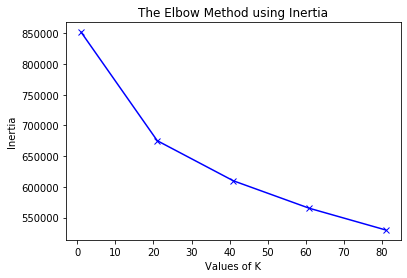
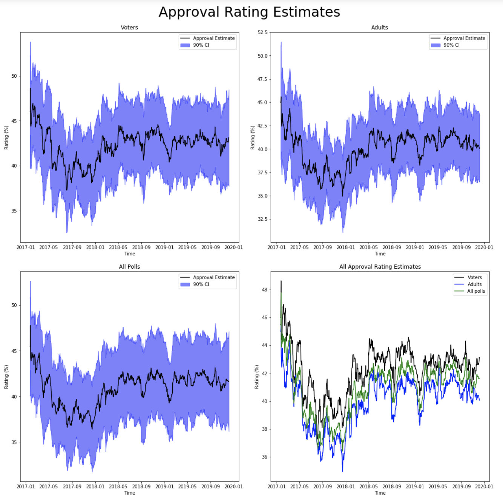
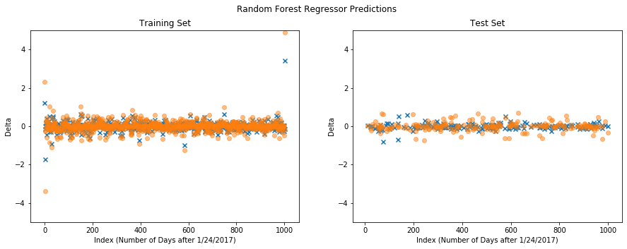
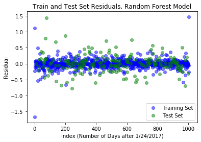
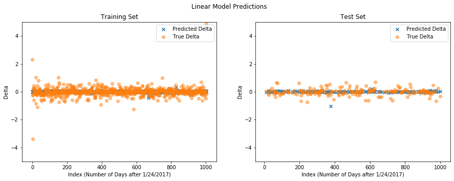

# Project Description

## Accompanying Materials
* All of the data used in our analyses can be found [here](https://github.com/msnwatson/cs109aproject/tree/master/data):
* The Jupyter notebook used to perform analysis can be found [here](https://github.com/msnwatson/cs109aproject/blob/master/trumptweetapproval.ipynb):

## Problem Statement and Motivation

We are interested in investigating the possible correlation between the topics of Trump's tweets and Trump's approval rating. 

To do this, we have constructed a model using the topics of Trump's tweets aggregated by day - as well as features describing the time of the tweets, retweet counts, type of day (weekday or weekend), and the previous day's approval rating - to predict the next day's approval rating. 

# Introduction

Since the rise of platforms like Facebook and Twitter, social media has become an increasingly important part of American politics. One of the politicians most associated with rise of social media in American politics is Donald Trump. President Trump is most associated with Twitter, tweeting over 11,000 times between his inauguration in January 2017 and October 2019.1 Largely replacing traditional forms of presidential communication (e.g., the White House Press Secretary) with Twitter, President Trump has tweeted, "I love Twitter.... it's like owning your own newspaper--- without the losses."2

Much academic research has investigated Trump's use of Twitter. Scholars have previously used machine learning and other sophisticated analytical tools to explore the association between Trump's tweets and various outcomes, such as the stock market and litigation. Studies of Trump's tweets have used different independent and dependent variables to explore relationships. For instance, sentiment analysis of Trump's tweets has used variation in the emotional valience of tweets to indicate that Trump's staff are more likely to tweet during business hours and Trump, with a more combative tone, is more likely to tweet outside of business hours.3 However, to our knowledge, no research has explored the relationship between the topics of Trump's tweets and Trump's approval rating.

In this project, we use Twitter data from Januray 2017 to October 2019 to ask: What is the relationship between the topics Trump tweets about one day and his approval rating the next day? This question is important because in furthers prior research that has investigated the implications of Trump's social media use on the sentiment of the American public towards his presidency. This research provides important insights into the relationship between the American president's novel use of a social media platform and implications for how Americans think of him.

To answer our research question, we construct a predictive model, using the topics of Trump's tweets as a primary predictor variable and the change to the next day's approval rating as a dependent variable. Before creating the predictive model, however, we select the most salient topics of Trump's tweets, that we theorize will have the largest impact on his approval rating using a k-means clustering model. In addition to using these topics selected based on an unsupervized clustering model, we also use a list of topics that we theorize are salient in American politics and therefore potentially important for approval ratings. By clustering the content of tweets, we identify 11 central topics. We then tag each tweet using these topics, aggregate these tags by day, and use this feature - as well as features describing the time of the tweets, retweet counts, type of day (weekday or weekend), and the previous day's approval rating - to predict change to the next day's approval rating.

Based on our analyses, we conclude that the topics of Trump's tweets one day are not predictive of the change in his approval rating to the next day. This result indicates that the topics of Trump's tweets do not have a significant effect on the American public's opinions of him in a short period of time. This may indicate that the people who approve of Trump are not effected by his tweet topics, the effect of tweets is not as immediate as some research has suggested, or - interestingly - sentiment may matter more than topic for approval ratings. While further research will be needed to investigate these possibilities, this paper makes an important contribution to understandings of the relationship between Trump's tweets and his approval rating.

In the following report, we first describe the Twitter and approval rating data used. Next, we review relevant research and then provide a detailed description of our modeling approach. These sections are followed by a section describing our project's trajectory and discussing results. Finally, we conclude by restating our findings, pointing to some limitations, and speculating on how we might improve this project if given more time.

# Literature Review

In this report, we investigate the relationship between the topics of Trump's tweets one day and the change in his approval rating to the next day. To construct our research question and subsequent modeling plan, we relied on the ["Donald Trump on Social Media" Wikipedia site](https://en.wikipedia.org/wiki/Donald_Trump_on_social_media#Background:_Social_media_in_the_United_States_presidential_election_campaigns)4 for a broad overview of Trump's social media use. This website motivated our project by showing that Trump tweets excessively (see also Carr 20185), and Trump's tweeting is unprecidented and an important subject of academic interest (see also Enli 20176). Our TF, Cedric, was also an important source motivating our question and shaping our modeling plan. After deciding to explore the relationship between the content of Trump's tweets and approval rating, Cedric helped narrow the project to focus on the topic of Trump's tweets as a primary independent variable and use the FiveThirtyEight approval rating polls7 as a dependent variable. 

# Description of Data

We used Trump tweets and related Twitter data provided by the class to create all of our independent variables. For our dependent variable - change in approval rating -, we used data that we downloaded at [this link] (https://projects.fivethirtyeight.com/trump-approval-ratings/) from FiveThirtyEight.com (at Cedric's recommendation).

After putting both the independent variables and the dependent variable into Pandas dataframes, it was important to verify that data were consistent. While the approval rating data was fairly clean - we only needed to drop confidence interval columns - the Twitter data required more careful inspection. The complete procedure for cleaning the data is detailed in the Jupyter notebook; however, a few notable findings are detailed here along with justifications:

*After 
*We also noticed that there were several null entries in the data. Since the missing categories included favorite_count and retweet_count, which are a huge part of our analysis, we dropped these entries from the main data frame and added them to a separate data frame. We also noticed several entries where the inputs for the features were mixed up. We also dropped these from the main data frame. Because there are only a few entries with missing data or mixed up data, we may try to find the tweets at a later date and manually re-enter the data for those tweets.
*Once we had dropped all of the NaN entries, we noticed that the favorite_count feature was the wrong data type. We converted the column’s data type from object to float. Then we split the main data frame into two separate data frames data_retweets and data_not_retweets so that we can look at trends in Trump’s retweets and Trump’s original tweets separately.

# Modeling Approach

## Feature Engineering

There are two major challenges associated with our project, both associated with the use of tweet data across time.

*Extraction of Usable Features from Tweet Data

We are specifically interested in how topics of tweets from President Trump affects approval ratings. There are several ways of proceeding. Our initial thought after looking through sklearn documentation was to use the DictVectorizer tool, essentially creating a counter for each unique word in all of the tweets and using this as the feature. However, we quickly realized that this would result in at least approximate high-dimensional data introducing all of the problems associated with the curse of dimensionality and limiting the variety and utility of techniques for our future analyses.

In order to address these concerns, we decided to use word embeddings in the form of Word2Vec. [Here](https://machinelearningmastery.com/what-are-word-embeddings/) is a primer on Word2Vec and other word embedding techniques. Though, this introduced some other concerns. In particular, training our own embedding to produce high-quality embeddings would require sufficiently large amounts of text and take quite a long time to train even if we had access to GPU. Then, to sidestep this issue, we followed Cedric's advice to use a pre-trained Word2Vec model provided by Google. Specific information on this model can be found [here](https://code.google.com/archive/p/word2vec/). For the purposes of this project, this choice is justified as unsupervised techniques are not covered in the course material, and Google has incentive to train a high-quality model. Vectors are averaged across strings, filtering out common English stop words. Sklearn's documentation describes that the built-in stop word list has some issues so a modified [external list](https://gist.github.com/sebleier/554280) which can be quickly scanned by the reader in the notebook was used. The goal of this aggregation is to attain a word embedding vector which represents the main topics of each tweet to "tag" tweets.

It is important to note that we take such great lengths to employ data science and machine learning techniques to classify tweets rather than manually constructing a list of keywords to avoid introducing our own biases into the classification, limiting the validation of any final conclusions we can make.

*Dealing with Non-Uniform Time Series Data

Another challenge is that tweet behavior occurs at non-uniform intervals in time, making it difficult to associate each tweet with a specific approval/disapproval rating in which we have day-length intervals. Instead of imputing poll scores to match the tweet data we ultimately decided to simply aggregate the set of tweets from any given day to featurize.

After addressing theoretical concerns associated with using longitudinal data, we created our variables. 

### Primary predictor of interest: 

*tag_list  
We operationalize our primary predictory variable of interest - the topics of Trump's tweets - using the variable tag_list. The variable was created in 5 steps: 
1. Clean tweet data    
    Before clustering, the tweet data was cleaned. First, each tweet was transformed into only lowercase characters, stopwords were removed, and URLs were removed. Next, each word in the tweets were stemmed, lemmatized, and tokenized. After the corpus of tweets was cleaned, each word was vectorized using the "Pre-Trained word and phrase vectors" created by Google in 2013 (at Cedric's helpful recommendation).  
2. Cluster tweet data  
    We clustered vectorized words using k-means clustering. We determined 20 was an appropriate number of clusters by using the elbow plot method (see figure below). We ran the clustering algorithm, varying the number of clusters in each iteration and measuring the sum of square errors of each cluster. Then, we selected the number of clusters near the elbow point.
3. Creating tags  
    After clusters were created, we read over the words closest to each cluster’s centroid to determine the topic the cluster was describing. Each word was listed and described quantitatively by its cosine similarity with the cluster’s centroid. If the word with the highest cosine similarity value was close to 1 (above 0.9) - indicating a high degree of closeness with the cluster centroid - it was used as the cluster’s topic. However, if the closest word did not have a cosine similarity sufficiently close to 1, we instead deduced a topic based on our reading of the cluster’s most characteristic words; e.g., the words with the highest cosine values. For example, the top four words in one cluster were: obama, clinton, mccain, hillary. In this cluster “obama” had a cosine similarity value of 0.97, so it was used as a tag. The top five words in a different cluster were: $, billion, tax, Unfunded_pension_liability. In this cluster, no word had a cosine similarity greater than 0.9, so we determined that the word most descriptive of this group of words was “money”. Because a number of clusters appeared to be capturing noise, the final list of tags included 11 words: 'obama', 'criminal', 'thanks', 'america', 'china', 'money', 'president', 'democrat', 'trump', 'vote', 'jobs'. In addition to this list of tags identified using unsupervized clustering, we used a list of 10 tags that we theorize capture important topics in current American politics: 'liberal', 'republican', 'foreign', 'policy', 'mexico', 'china', 'russia', 'obama', 'taxes', 'media'.
4. Tagging tweets  
    Each of the 11 tags (or 10, when using the list created a priori) were checked for fit with each word in each tweet. Fit was determined by a cosine similarity, between the tag and the word, equal to or greater than 0.5. This threshold was determined based on tests of various thresholds and our assessment that 0.5 best captures the important content of the tweets without tagging too many words. Tags were grouped by tweet.
5. Pandas Dataframe and Tag Encoding  
    Step 4 produced a dictionary with keys corresponding to tweet indices and values corresponding to a list of tags (some lists were empty, some had multiple tags). This dictionary was added to the Pandas Dataframe containing our other predictor variables.

### Secondary predictors of interest: 

* Average and variance  
In general, we chose to consider averages because our target variable is approval rating by day. So we needed to generalize data from all the tweets in one day to a single data point. Taking an average also allows us to address the non-uniformity of time-series data. Since each day has a different total number of tweets, the average number of retweets is more informative than the total number of retweets. We also included variance as a predictor because it indicates how we should interpret the average and how we weigh it in our model. For example, if two days have the same average number of retweets but day one has low variance and day two has high variance, this could indicate that on day 1, Trump was tweeting about a significant issue multiple times throughout the day but on day two, Trump tweeted once or twice about a significant issue. 

* rt_avg and rt_var   
We include the average retweet count for every day as a kind of proxy to capture public “engagement” with a particular day’s set of tweets; this engagement might be either positive or negative. Tweets that are retweeted more might be both more viewed (and thus likely to impact more people) or more “important” to people, in the sense that Trump’s followers are more likely to retweet tweets that they care about more (and thus likely to impact people more). Either interpretation of the retweet count would be important in assessing the association of a given day’s tweets with his future approval rating.

* time_avg and time_var  
We include a feature describing the time (average and variance) when @RealDonaldTrump tweets because previous investigation has shown the content of @RealDonaldTrump tweets varies systematically by time of day. For instance, these investigations have concluded that tweets released outside of business hours are more likely to be combative and be written by Donald Trump rather than his staff. Therefore, the time_of_tweet variable captures variation important for understanding the relationship between tweets and public sentiment towards Trump.  

* tweet_count  
We included each day’s tweet count as a feature to weight each tag in our tag list by the number of tweets that day in addition to then number of times that tag appears in a specific tweet. We also did this to take into account the possibility that the types of tweets might be associated with the total number of tweets on a certain day. 

* is_weekend  
We included weekend as a boolean variable to take into account the differences in tweeting and retweeting behavior on weekends versus weekdays. The content of the tweets might also vary depending on whether it is a weekend or weekday.

* previous_approval  
The previous day’s approval is likely to be heavily correlated with the next day’s approval rating; extremely large swings in approval are probably less likely than more moderate swings. In general, assuming that people change whether or not they approve of Trump based on certain events (including, potentially, tweets), allows us to model a given day’s approval rating  based on the previous day’s approval rating offset by a delta of those who changed their views in the interim.

### Response Variable:

* approve_estimate  
We used the approval estimate as a response variable, attempting to predict the approval estimate from a given day based off of the tweets of the day and the approval rating of the previous day. It is also an accessible ground truth, against which we can compare our predictions for training and testing purposes. 

We conducted an EDA on the poll data (see below) and chose to only consider the approval estimate for All Polls. We plotted the approval estimates versus time and compared the similarity scores between the data for Adults, Voters, and All polls data to the variance of the data and determined that the data were not significantly different between these three categories. This decision also makes sense because the population engaging with Trump’s tweets is not exclusively voters or adults, so we must consider data from all polls.

## Model Overview 

Before creative our predictive model, we clustered vectorized word tokens to determine salient topics. We choose to cluster using k-means for two reasons: (1) k-means is computationally efficient, and (2) we are concerned with relative rather than absolute distance. One of the main critiques of k-means is that it uses Euclidean distance, which increases absolute distance between data points as dimensionality increases; however, for our problem, we are only concerned with relative distances.

For our predictive model, using the features from above, we first constructed a baseline Ordinary Least Squares (OLS) model, training the featurized tweets (tag_list, as well as all of the secondary features mentioned above) against the response variable. We then trained and fit a Random Forest regression model, OLS models with augmented polynomial features and interaction terms, and a second degree polynomical OLS model with interaction terms. Then, we ran the second degree polynomial model with interaction terms and LASSO regularization. We introduced regularization to address issues of multicollinearity, overfitting, and outliers.

# Project Trajectory

When starting this project, our group had a broad idea that we wanted to understand how Trump's tweet behavior affected popular sentiment. However, we struggled to create a question that could be answered using the tools of data science reviewed in the course, and especially struggled with operationalizing variables of interest.

After receiveing feedback from Cedric directing us away from sentiment analysis, we created a new research question based on our theory that the topics of Trump’s tweets influence popular discourse surrounding those topics and variation in Trump's stance toward different topics may affect his approval rating. As a result, we decided to build a model based on "tagging" tweets by topic to predict fluctuations in approval ratings.

After solving our "finding a researchable research question" problem, we ran into a second problem when we realized, in order to model the relationship between tweet topics and fluctuations in approval ratings, we needed to classify tweets by topic. Due to our project members’ negative sentiments toward Trump and the arbitariness of selecting topics a priori, we worried  we may introduce bias when selecting topics. To minimize this potential bias, we performed cluster analysis. However, despite avoiding the bias introduced if we choose topics based on our beliefs about political salience, we realized bias was still being introduced; we were required to use our judgement to select hyper parameters and preprocess the data. Nevertheless, we reasoned that using an unsupervized cluster model to select topics was the most principled way of choosing topics and minimizing bias as much as possible.

Our third problem had to do with using non-uniform time series data. We realized that Trump’s use of tweets reflects a need to disseminate information quickly, and so wanted to constrain the time effects of tweets on approval ratings to single day effects. Once we decided on the use of poll data as a measure of population sentiment, this informed our decision to aggregate features of specific tweets by day in order to create uniform time intervals and thereby preserve time derivatives which we felt were important. When deciding how to aggregate tweet data, we tried to preserve aspects of the original tweets by including the first and second moments of the retweet and time-of-day features. 

Finally, to determine which models were appropriate for this problem, we looked through class notes to find methods and models discussed in class. We understood we were working in a regression context which eliminated several modeling possibilities. When evaluating our models, we kept in mind that some of our features may be correlated and implemented regularization and other methods to help control for the negative effects this could have on our data.

# Results and Interpretation

This goal of this project was to predict how much Trump’s approval rating would change based on his tweets' topics, which we featurized for every given day, described in the “feature extraction” section. The naive OLS model performed, unsurprisingly, poorly, with an R2 score of 0.02475 on the training dataset and only -0.09466 against the test. 

The naive implementation of the random forest performed particularly poorly, scoring consistently into the negatives (an average of -0.46 over 100 runs on the test dataset) with just the default values. Even using GridsearchCV to fine-tune for optimal hyperparameters and cross-validate to avoid extensive overfitting, the results were not much better - iterating over different values for max_features, feature_depth, and min_samples_split, the cross-validated score never reached a positive R2.

You can see clear evidence of overfitting here with predictions fairly close to the true values on the training set. We also examined the residuals on both the training and test sets and found that the distributions of the residuals on the test set is roughly on the same scale as the distribution of the actual predicted values on the test set. This tells us that the model is not significantly better than randomly guessing the delta values.

The polynomial OLS models also performed poorly. We used two design matrices produced from augmenting the original featurized vectors to fit two OLS models (degree 1 and degree 2). The degree 1 model performed marginally worse than the baseline linear model; the degree 2 model performed worse than the single degree model, likely because of overfitting. 

When we attempted to use LASSO regularization on a third OLS model to reduce multicollinearity and overfitting, the regularization reduced all coefficients to 0, indicating that none of the coefficients we selected were statistically significant in predictive power. 

None of the models ever reached a positive R2, suggesting that we never outperformed a trivial horizontal line (the “predict the mean value” model). This result is not wholly unexpected; even if tweets have predictive power, there would almost certainly be other factors responsible for part of the variation in Trump’s approval rating, like his actual policy decisions or information from external news sources, that would not be captured in our tweet data. Unfortunately, if the tweets are only responsible for a relatively small proportion of Trump’s approval rating delta, issues arise from the aggregate polling data from fivethirtyeight.com we used as ground truths. 

Polling data is inherently uncertain, and especially looking at the graphs of the 90% confidence interval it appears that for the vast majority of the timeline the confidence interval bounds the actual approval rating range, which varies relatively little (for example, after April 2017, the approval rating never leaves about a 37-43% range). Using the polling data as ground truths forces us to try to predict the polling data based on the correlation between the tweets and Trump “true” approval rating, and then between Trump’s “true” approval rating and the polls, introducing another confounding layer of complexity to our predictive models. Then, it is possible that some small, but statistically significant, association between the tweets and the “real” approval rating exists that is muffled by uncertainties in the polling data. 

It is possible that the tweets themselves have no effect on his approval rating, and that people simply do not consider what Trump tweets at all with regards to whether or not they approve of him. It is also possible that the people who regularly interact with Trump’s twitter are a somewhat self-selecting group, who are either strong enough supporters or detractors (who follow Trump to criticize or mock the things he tweets) that their approval of Trump is not very like to change at all, much less in response to a given day’s tweets. 

# Conclusions and Future Work

Using appropriate modeling techniques learned in this course, we find that the topics of Trump's tweets - along with aggregate statistics of the number of times his tweets are retweeted and the time of day tweets are tweeted - are not correlated with the change in approval rating between the day of tweeting and the next day. Our finding that there is no correlation between tweet topic and change in approval rating to the next day, may be because the effect of tweet topics is delayed more than one day. Another possible explanation of our finding is that the people whose approval rating is most effected by Trump's tweets (e.g., frequent Twitter users) are not representative of the broader public contributing to Trump's daily approval rating. However, it is important to recognize that these results do not imply Trump's tweets do not affect approval ratings; rather, they imply the topic of Trump's tweets one day do not affect the change in his approval to the next day.

One limitation of our analysis is that it only tests for the effect of one day's tweets on the next day's approval ratings. While this is useful in testing whether tweets have a short-term effect on approval ratings, it does not answer the question of whether tweets effect approval ratings more generally. It could be the case that tweets take several days or even weeks to impact approval ratings. Given more time, we would expand our analysis of the time-series data, for example taking a week’s tweets and aggregating in a way which weights more recent tweets in a kind of staggered model. In general, we would have liked to use more sophisticated time series analysis techniques; however, because of time constraints, we were unable to perform outside research (given that there are entire courses focusing on this topic) and this course has not focused on such techniques.

Given more time, we would also learn more about selecting salient topics via clustering techniques. Our work assumes the most central tweet topics have the greatest association with approval ratings, as implied by our technique of “tagging” each tweet based on a word's proximity to a cluster's centroid. However, it is possible that the most  “predictive” words are not close to cluster centroids. Moreover, while we used a principled “tagging” technique (testing individual word proximities to centroids), the problem of classifying strings of text longer than one word by topic is an open problem in machine learning and data science. Then, given more time, we would also conduct experiments to test the effect of different tagging techniques on accuracy of predictive models.

1Shear, Michael D., Maggie Haberman, Nicholas Confessore, Karen Yourish, Larry Buchanan, and Keith Collins. 2019. “How Trump Reshaped the Presidency in Over 11,000 Tweets.” The New York Times, November 2.

2Trump, Donald J. 2012. “I Love Twitter.... It’s like Owning Your Own Newspaper--- without the Losses.” @realdonaldtrump. Retrieved December 11, 2019 (https://twitter.com/realdonaldtrump/status/267286284182118400?lang=en).

3Greenemeier, Larry (August 18, 2016). "Only Some of @realDonaldTrump's Tweets Are Actually Donald Trump". Scientific American. Archived from the original on August 6, 2017. Retrieved June 2, 2017.

4Anon. 2019. “Donald Trump on Social Media.” Wikipedia.

5Carr, Nicholas. 2018. “Why Trump Tweets (And Why We Listen).” POLITICO Magazine. Retrieved December 11, 2019 (http://politi.co/2BvZsIV).

6Enli, Gunn. 2017. “Twitter as Arena for the Authentic Outsider: Exploring the Social Media Campaigns of Trump and Clinton in the 2016 US Presidential Election.” European Journal of Communication 32(1):50–61.

7Silver, Nate. 2017. “How Popular Is Donald Trump?” FiveThirtyEight. Retrieved December 11, 2019 (https://projects.fivethirtyeight.com/trump-approval-ratings/).
